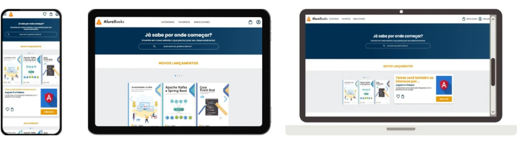

# 📗 AluraBooks

Projeto desenvolvido focando em responsividade de telas.

Adotada a abordagem Mobile First começando o projeto com telas menores e expandindo, dando assim várias possibilidades de acesso ao site para o usuário, seja por celular, tablet ou desktop.

Para isso utilizei os Medias Queries, que são regras de CSS que permitem aplicar estilos diferentes para mais de um tamanho de tela.

[Acesse o projeto](https://vmalagrino.github.io/alura-books)

## 💻 Tecnologias utilizadas

- HTML
- CSS
- Media Query
- Swiper (biblioteca JavaScript utilizada para criar sliders em projetos web)

## 🎈 Contato

[LinkedIn](https://www.linkedin.com/in/victor-malagrino-26680a1a2/)
